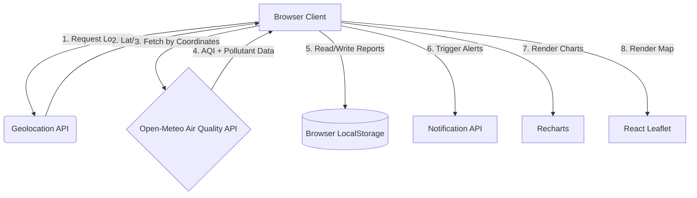

<div align="center">

# 🌍 Pollution Control Hub

**Monitor. Understand. Act.**

A community-driven web app that turns raw air quality data into clear health guidance and local climate action.

<p>
  
  
  
  
  
</p>

<p>
  
  
  
  
</p>

[Report Bug](https://github.com/Aditya8369/Pollution-Control-Hub/issues) · [Request Feature](https://github.com/Aditya8369/Pollution-Control-Hub/issues) · [Contribute](CONTRIBUTING.md)

</div>

---

## 📑 Table of Contents

- [About the Project](#-about-the-project)
- [Key Features](#-key-features)
- [System Architecture](#️-system-architecture)
- [Tech Stack](#-tech-stack)
- [Project Structure](#-project-structure)
- [Getting Started](#-getting-started)
- [Environment Variables](#️-environment-variables)
- [API Integration](#-api-integration)
- [Contributing](#-contributing)
- [Code of Conduct](#-code-of-conduct)
- [License](#-license)

---

## 🚀 About the Project

Urban air pollution is a silent crisis. Raw AQI numbers exist, but most people don't know what they mean or what to do about them.

### 📍 Interactive Geospatial Mapping
- **Hotspot Map:** Built on Leaflet maps with real AQI-sampled markers. A 3×3 grid of coordinates is queried around the user's location via Open-Meteo, and the top hotspots are ranked and labeled by cardinal direction (e.g. "North-East zone").
- **Geolocation Support:** Automatically pins the user's location to center calculations and alerts on nearest hotspots.
- **Grid Result Caching:** Nearby grid results are cached for 5 minutes to avoid redundant API calls on rapid refreshes.

1. **Visualizing complex data** — turning raw telemetry (PM2.5, PM10, CO, NO₂, Ozone) into intuitive, color-coded insights.
2. **Contextualizing health risk** — surfacing direct advisories and prevention tips based on real-time exposure.
3. **Fostering community action** — letting residents flag local pollution events and mobilize collective response.

---

## ✨ Key Features

| Module | What it does |
| :--- | :--- |
| 📊 **Dashboard** | Live AQI readings for the selected or auto-detected city, with auto-refresh every 3 minutes. |
| 📈 **Analytics & Insights** | Multi-city comparisons and weekly/monthly pollutant trends powered by Recharts. |
| 🗺️ **Location Map** | Interactive Leaflet map with geolocation support and pollution hotspot markers. |
| 🔔 **Alerts Panel** | Threshold-based exceedance warnings and safe-exposure timers. |
| 🩺 **Health Advisory** | Tailored guidance for children, elderly, asthmatics, and the general population. |
| 🤝 **Community Hub** | Crowd-sourced pollution reporting with upvotes, stored locally per user. |
| 🧪 **Scenario Simulator** | Model how different conditions affect local air quality. |
| 🌱 **Solutions & Awareness** | Actionable tips and policy context for cleaner cities. |
| 🧠 **Quiz Section** | Short quizzes to build environmental awareness. |

---

## 🗺️ System Architecture



---

## 🧰 Tech Stack

| Layer | Technology | Why |
| :--- | :--- | :--- |
| Framework | **React + Vite** | Fast dev server, optimized production build |
| Mapping | **React Leaflet** | Open-source mapping, no paid API keys required |
| Charts | **Recharts** | Declarative, React-native charting |
| Data Source | **Open-Meteo Air Quality API** | Free, hourly-resolution air quality data |
| Persistence | **LocalStorage** | Lightweight client-side storage for community reports |

---

## 📂 Project Structure

```text
Pollution-Control-Hub/
├── src/
│   ├── components/
│   │   ├── AlertsPanel.jsx
│   │   ├── AnalyticsInsights.jsx
│   │   ├── CommunityHub.jsx
│   │   ├── Dashboard.jsx
│   │   ├── HealthAdvisory.jsx
│   │   ├── LocationMap.jsx
│   │   ├── QuizSection.jsx
│   │   ├── ScenarioSimulator.jsx
│   │   └── SolutionsAwareness.jsx
│   ├── constants/cities.js
│   ├── services/airQualityService.js
│   ├── App.jsx
│   ├── main.jsx
│   └── styles.css
├── index.html
├── vite.config.js
└── package.json
```

---

## 🖥️ Getting Started

### Prerequisites
- Node.js 18+
- npm

### Installation

```bash
# 1. Fork, then clone your fork
git clone https://github.com/<your-username>/Pollution-Control-Hub.git
cd Pollution-Control-Hub

# 2. Install dependencies
npm install

# 3. Start the dev server
npm run dev
```

Open [http://localhost:5173](http://localhost:5173) in your browser.

```bash
npm run build     # Production build
npm run preview   # Preview the production build
```

---

## ⚙️ Environment Variables

The app works zero-config out of the box. For custom deployments, create a `.env` file:

```env
# Notification threshold (US AQI scale, 0-500)
VITE_ALERT_THRESHOLD=100

# Fallback location if geolocation is denied (defaults to Delhi)
VITE_DEFAULT_LAT=28.6139
VITE_DEFAULT_LNG=77.2090
```

> **Note:** Geolocation and browser notification prompts appear on load. If denied, the app falls back to default coordinates and disables push alerts.

---

## 🔌 API Integration

Air quality data comes from the **Open-Meteo Air Quality API**:

```bash
https://air-quality-api.open-meteo.com/v1/air-quality?latitude=28.61&longitude=77.21&hourly=pm2_5,pm10,nitrogen_dioxide,ozone,carbon_monoxide,us_aqi&current=us_aqi
```

```javascript
const fetchAirQuality = async (lat, lng) => {
  const response = await fetch(
    `https://air-quality-api.open-meteo.com/v1/air-quality?latitude=${lat}&longitude=${lng}&hourly=pm2_5,pm10,nitrogen_dioxide,ozone,carbon_monoxide,us_aqi&current=us_aqi`
  );
  if (!response.ok) throw new Error("Failed to retrieve air quality data");
  const data = await response.json();
  return { currentAqi: data.current.us_aqi, pollutants: data.hourly };
};
```

---

## 🤝 Contributing

This project is participating in **ECSoC'26** — contributions are welcome! 🎉

1. Check the [issues](https://github.com/Aditya8369/Pollution-Control-Hub/issues) for `good first issue` or `help wanted` labels.
2. Comment on an issue to get assigned before starting work.
3. Follow the branch naming and commit conventions in our full guide.

📖 Read the complete [**Contributing Guide**](CONTRIBUTING.md) for setup, branch naming, commit conventions, and the PR process.

---

## 🌍 Code of Conduct

Please read our [Code of Conduct](CODE_OF_CONDUCT.md) before participating in this project.

---

## 📄 License

Distributed under the **MIT License**. See [LICENSE](LICENSE) for details.

---

<div align="center">

**From awareness to action — one city at a time.** 🌱

</div>